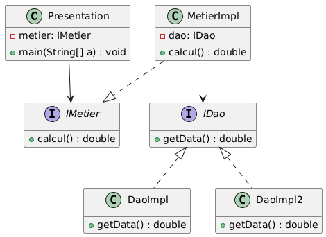

# TP : Inversion de Contrôle et Injection des Dépendances en JEE

## 📌 Introduction
L'Inversion de Contrôle (IoC) et l'Injection de Dépendances (DI) sont des principes fondamentaux en développement Java/JEE pour améliorer la modularité et la testabilité du code.

- **Inversion de Contrôle (IoC)** : Principe selon lequel l'instanciation des objets et leur gestion sont déléguées au framework plutôt que d'être gérées manuellement dans le code.
- **Injection de Dépendances (DI)** : Technique permettant d'injecter des dépendances dans une classe sans qu'elle ait besoin de les instancier elle-même, favorisant ainsi la séparation des responsabilités.

## Injection des Dépendances : Approches Utilisées



### 1. Injection des Dépendances par Instanciation Statique
Dans cette approche, les dépendances sont instanciées directement dans le code. C'est une approche simple mais qui pose des problèmes de flexibilité et de maintenance.

#### Exemple :
```java
public class PresentationV1 {
    public static void main(String[] args) {
        IDao dao = new DaoImpl(); // Instanciation directe
        IMetier metier = new MetierImpl(dao); // Injection par constructeur
        System.out.println("Résultat : " + metier.calcul());
    }
}
```

### 2. Injection des Dépendances par Instanciation Dynamique
Ici, l'instanciation est effectuée dynamiquement à l'exécution à l'aide de la réflexion Java. Cela permet une plus grande flexibilité en chargeant les classes depuis un fichier de configuration.

#### Exemple :
```java
Scanner scanner = new Scanner(new File("config.txt"));
String daoClassname = scanner.nextLine();
Class<?> cDao = Class.forName(daoClassname);
IDao dao = (IDao) cDao.getConstructor().newInstance();
```
**Avantages** :
- Découplage entre les classes.
- Possibilité de modifier l'implémentation sans toucher au code source.

## Utilisation de Spring pour l'Injection des Dépendances
Spring permet d'automatiser l'injection des dépendances en utilisant des fichiers XML ou des annotations.

### Injection via Configuration XML
Dans cette approche, nous définissons les dépendances dans un fichier `applicationContext.xml`.

#### Exemple :
```xml
<beans xmlns="http://www.springframework.org/schema/beans"
       xmlns:xsi="http://www.w3.org/2001/XMLSchema-instance"
       xsi:schemaLocation="http://www.springframework.org/schema/beans
                           http://www.springframework.org/schema/beans/spring-beans.xsd">
    
    <bean id="dao" class="dao.DaoImpl"/>
    <bean id="metier" class="metier.MetierImpl">
        <property name="dao" ref="dao"/>
    </bean>
</beans>
```
**Avantages** :
- Séparation entre la configuration et le code.
- Facilité de modification des dépendances.

### Injection via Annotations
Avec Spring, on peut annoter directement les classes pour spécifier l’injection des dépendances.

#### Exemple :
```java
@Component
public class DaoImpl implements IDao {
    public double getData() {
        return 100;
    }
}
```

```java
@Service
public class MetierImpl implements IMetier {
    @Autowired
    private IDao dao;
    
    public double calcul() {
        return dao.getData() * 2;
    }
}
```
**Avantages** :
- Moins de configuration XML.
- Injection automatique et gestion simplifiée.

## Conclusion
L'injection de dépendances permet de créer des applications plus flexibles et maintenables. En passant d'une instanciation statique à dynamique, puis en adoptant Spring, on obtient une architecture plus modulaire et évolutive.